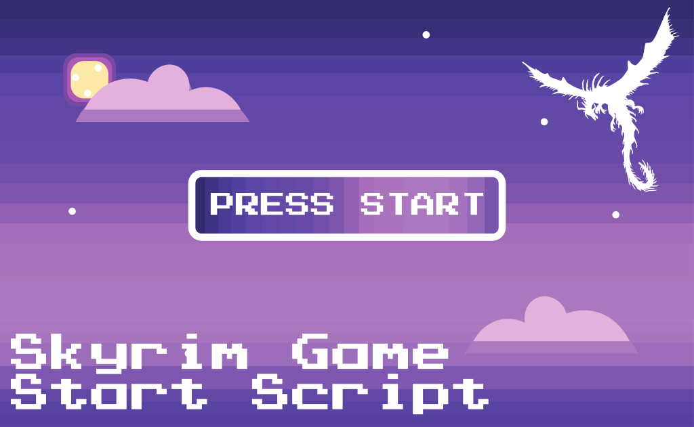

# Skyrim Game Start Script

> Run a script whenever the Main Menu loads
>
> e.g. `coc riverwood`

### How it works

If `Data/StartupScript.bat` is provided (_e.g. via a MO2 plugin_) then it is run when the Main Menu loads.

Else if an environment variable named `SKYRIM_STARTUP_SCRIPT` is configured to the path of a script, that script is run when the Main Menu loads.

That's all!

_e.g. I use it to run an AutoHotkey script to `coc riverwood` from the Main Menu `*`_

> `*` _because trying to `coc` to riverwood using SKSE doesn't work from the Main Menu - if you get it working, PLEASE let me know!_
